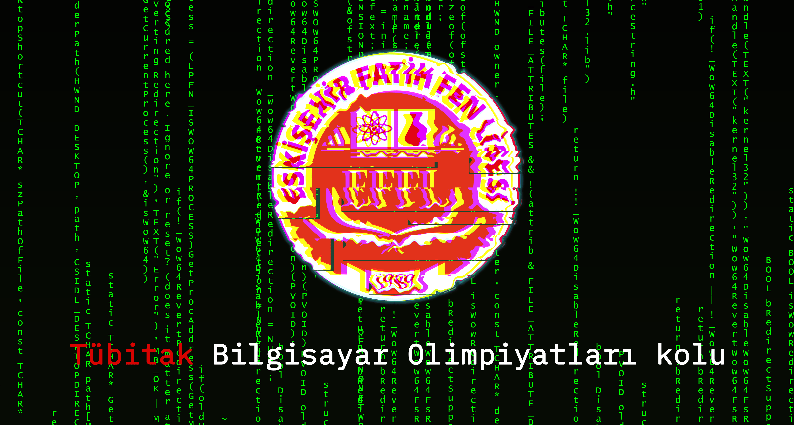

<meta name="viewport" content="width=device-width, initial-scale=1">
<link rel="stylesheet" type="text/css" media="all" href="markdown.css" />

# Eskişehir Fatih Fen Lisesi Bilgisayar Olimpiyatları

Eskişehir Fatih Fen Lisesi'nin bilgisayar olimpiyatları reposudur. Kaynaklar, kodlar buradan paylaşılacaktır. (derli toplu olması açısından)

## İçerik

- Programlama 101

### C

1. Ders:

- [Basit I/O](/C-practices/1st-week/basic-io)
- [Değişkenler](/C-practices/1st-week/Variables/degiskenler.c), [sabit değerler](/C-practices/1st-week/Variables/sabit_degerler.c) (const / constant), [değişken türleri](/C-practices/1st-week/Variables/degisken_turleri.c)
- Aritmetik operatörler, mantıksal operatörler
- [Koşullamalar](/C-practices/1st-week/conditionals-part1) (if-else)
